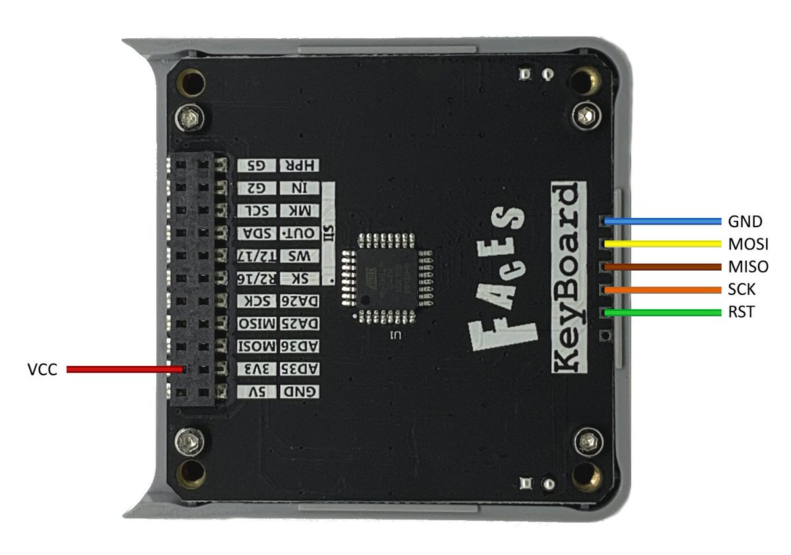

# FACES

This repository is about the firmwares of FACES Keyboards(*QWERTY, GameBoy, Calculator*).

They communicate with M5Core through I2C(*I2C address is 0x08*). You can program FACES through MicroPython or Arduino.

## Burn Firmware
 

|Item|Value|
|:---|:---|
|Programmer| **USBasp** etc...|
|Board|**Arduino Pro or Pro Mini**|
|Processeor|**ATmega328P (3.3V, 8MHz)**|

\[Sketch | Upload Using Programmer\]
